## Веб-приложение "Кинотеатр"

Приложение представляет собой сервис для покупки билетов в кинотеатр.

Стэк технологий технологий:
- Spring boot
- Spring Security
- Thymeleaf
- Bootstrap
- PostgreSQL
- JQuery

Для запуска требуется:
- Java 17
- Maven
- PostgreSQL

Порядок запуска:
1. Создать базу данных
````
CREATE DATABASE cinema
````
2. Запустить проект
````
mvn spring-boot:run
````
При первом запуске в базе создаются:
- Жанры.
- 3 кинозала.
- Пользователь с правами администратора.
````
login: admin password: 123456
````
3. На главной странице перейти к форме авторизации.
   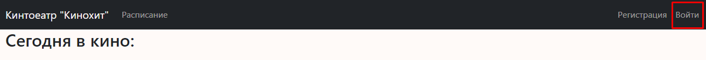
4. Ввести указаные выше логин и пароль.
   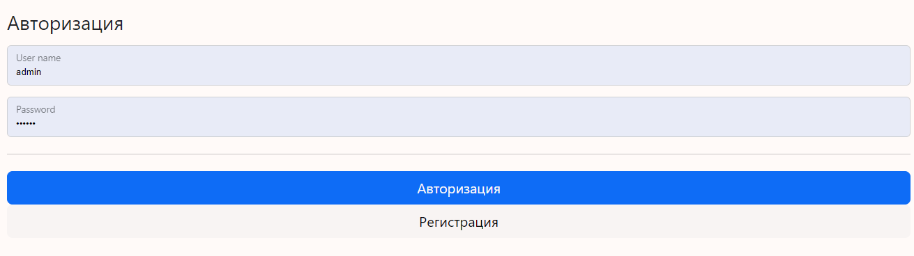
5. В выпадающем меню выбрать пункт "Фильмы", после перехода в кписку фильмов - перейти к добавлению нового фильма.
   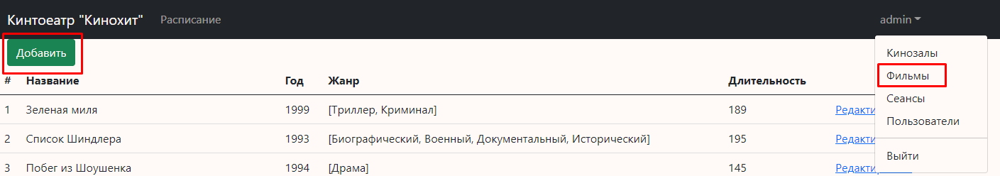
6. Заполнить данные о фильме, выбрать постер, сохранить.
   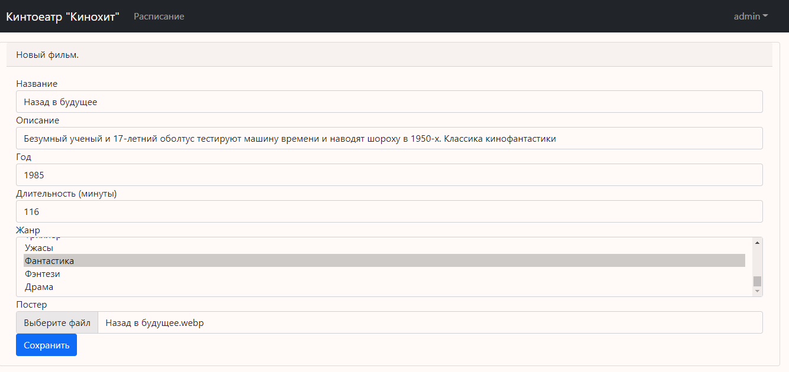
7. В выпадающем меню выбрать пункт "Сеансы", на странице списка сеансов - перейти к добавлению нового сеанса.
   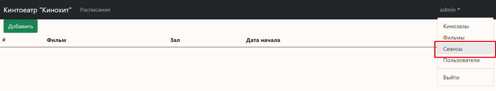
8. Заполнить данные: выбрать фильм, кинозал, дату начала сеанса, сохранить.
   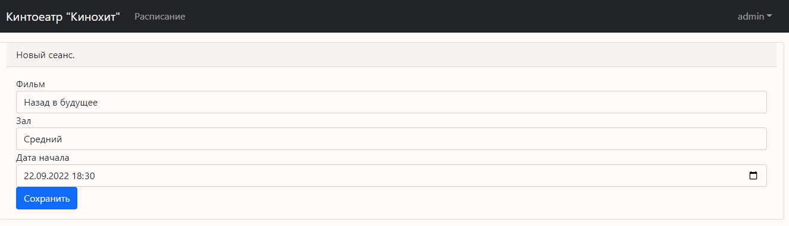

### Покупка билетов пользователем 
1. Переход к регистрации.
   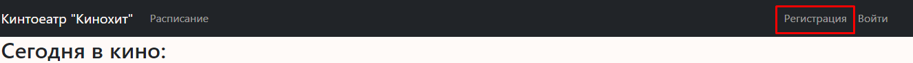
2. Форма регистрации.
   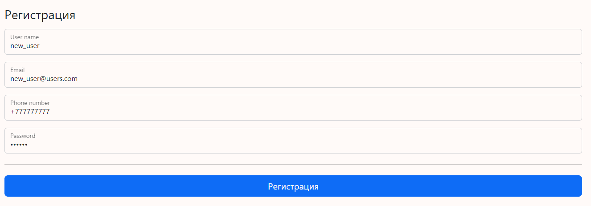
3. После входа на главной странице выбрать фильм.
   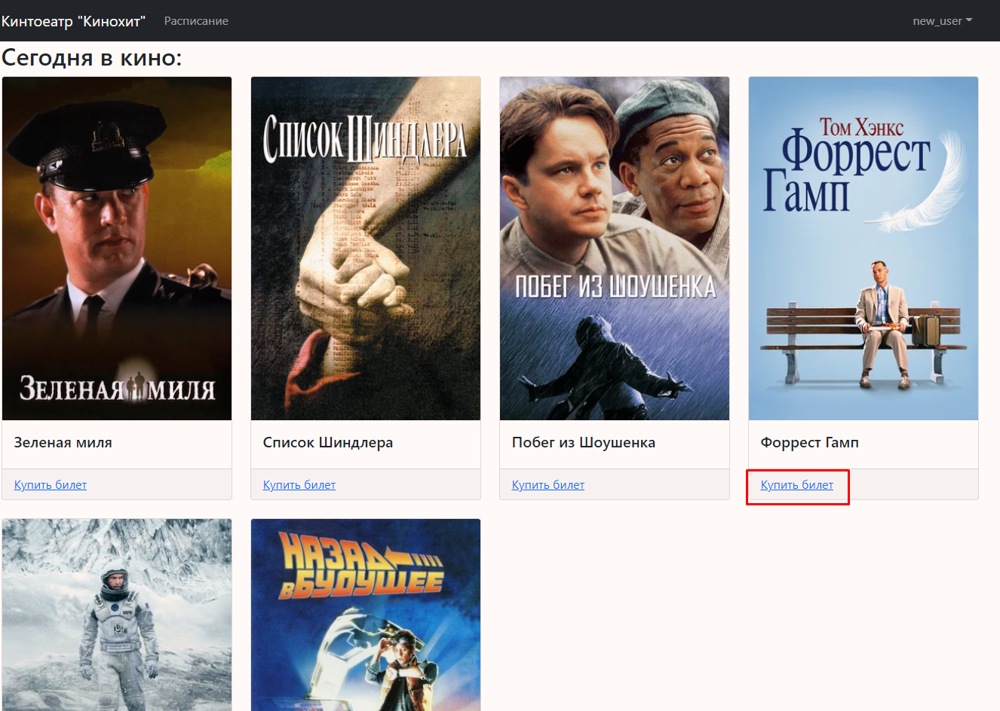
4. Выбрать время сеанса.
   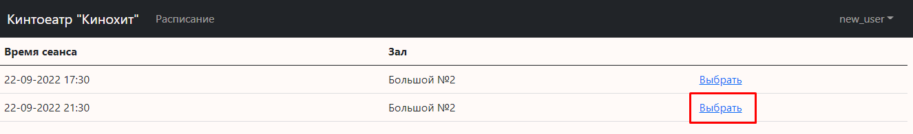
5. Выбрать места, выполнить покупку, нажав кнопку "Купить"
   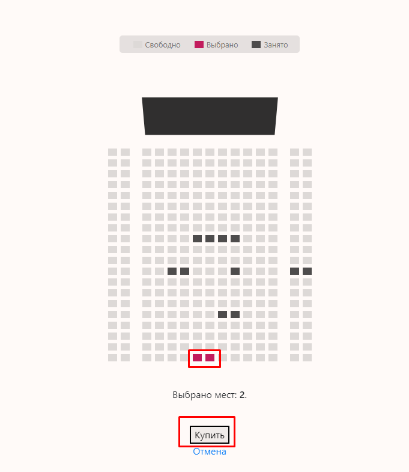
   - Если места доступны, то пользовтаель получит сообщение об успешной покупке, и перенаправлен на страницу с билетами:
     
     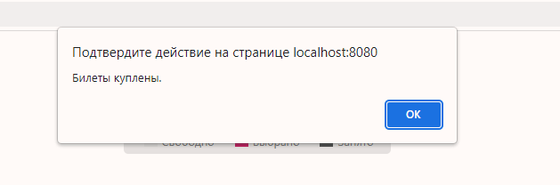
     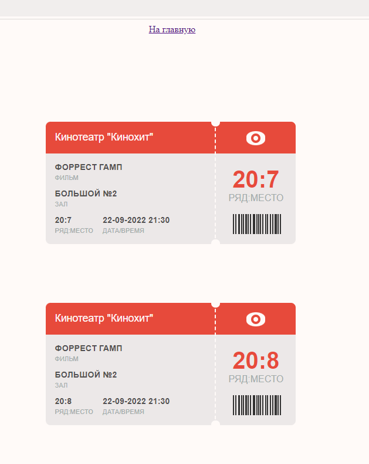
   - Если в процессе выбора, выбранные места успел купить другой пользователь, то будет выведено сообщение об ошибке, и страница обновится.
     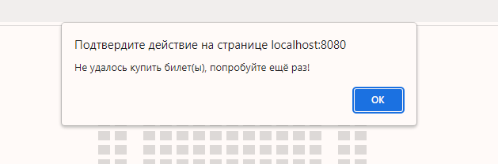
   
